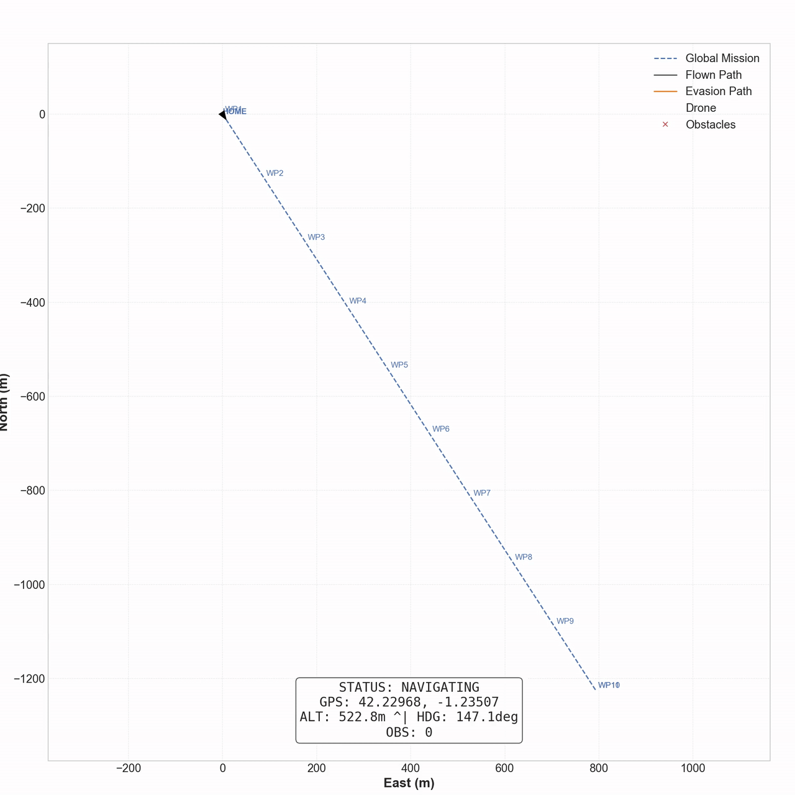

# Deep-AeroTwin: Autonomous Navigation & Digital Twin Framework

**Version:** 3.0 (Blackwell Ready)  
**Date:** January 2026  
**Core:** PORCE System (Path planning & Obstacle avoidance with Real-time Collision Evasion)

<div align="center">
  
</div>

## 1. Overview

**Deep-AeroTwin** is a high-performance aerospace framework designed to bridge the gap between simulation and reality using NVIDIA RTX 50-series hardware. It operates on a **Dual-Pipeline Architecture**, allowing a single codebase to serve two distinct operational goals:

1.  **Pipeline A (Simulation):** Autonomous HITL flight in Unreal Engine 5.6.
2.  **Pipeline B (Digital Twin):** Real-time replication of a physical drone's environment for remote teleoperation.

---

## 2. Quick Start (Dual Launchers)

The project now includes dedicated launchers for each mode. **Do not run `launch.bat` directly** unless you know what you are doing.

### Pipeline A: Autonomous Simulation
*   **Goal:** Test AI evasion logic against synthetic obstacles.
*   **Launcher:** `launch_pipeline_A.bat`
*   **Components:** SITL (WSL) + Unreal Vision (Screen Capture) + Brain + Recorder.
*   **Behavior:** Drone flies autonomously. Detects obstacles via MSS Screen Capture. Avoids them using A*.

### Pipeline B: Digital Twin (Real World)
*   **Goal:** Replicate real-world hazards in Unreal for a human pilot.
*   **Launcher:** `launch_pipeline_B.bat`
*   **Components:** Brain (Real Drone Mode) + Vision (Real Video Feed) + Recorder. **NO SITL**.
*   **Behavior:** 
    1.  Vision System detects real obstacles (Cows, Bikers) from video.
    2.  Brain exposes object data via API (`/api/unreal/sync`).
    3.  Unreal Engine (VaRest) polls API and spawns virtual obstacles in real-time.

---

## 3. The PORCE System (Intelligence Core)

The **PORCE** (Path planning & Obstacle avoidance) engine manages the drone's safety. It is mode-aware and adjusts its physics based on the active pipeline.

| Parameter | Pipeline A (Sim) | Pipeline B (Real) | Description |
| :--- | :--- | :--- | :--- |
| **Cruise Speed** | 8.0 m/s | 5.0 m/s | Slower in reality for safety. |
| **Detection Range** | 80 m | 150 m | Max reliable vision range. |
| **Reaction Distance** | 45 m | 60 m | Distance to trigger evasion. |
| **Safety Radius** | 12 m | 12 m | Hard keep-out zone. |

### Safety Mechanisms
*   **Look-Ahead Orientation:** The drone's yaw is locked to its velocity vector, ensuring the camera always faces the direction of travel for continuous obstacle scanning.
*   **Infinite Column Assumption:** Safety logic that forbids flying directly over vertical structures (towers) to avoid high-voltage lines. The system only plans detours *around* obstacles.
*   **Emergency Escape:** If the drone initializes inside a danger zone, a specific routine prioritizes exiting the safety radius before navigation resumes.

---

## 4. Vision Engine & Synthetic Data (RTX 5090)

The project leverages **YOLOv11 Nano** optimized for NVIDIA Blackwell architecture (CUDA 12.8).

### Synthetic Training Workflow (`3d_to_dataset_xabi/`)
We generate our own datasets to detect specific hazards not found in COCO (like Electric Towers).
1.  **Assets:** 3D Models (`.obj`) of Bikers, Cows, and Towers.
2.  **Generation:** `generate_dataset.py` uses **PyRender** to create thousands of 640x640 labeled images with random backgrounds, lighting, and angles.
3.  **Training:** `train_yolo.py` fine-tunes YOLOv11n on this custom dataset.

**Current Model Status:**
*   **File:** `yolo11n.pt`
*   **Classes:** Person, Bicycle, Cow (Base COCO). *Custom Tower training in progress.*

---

## 5. Technical Architecture (Microservices)

The system is composed of independent Python processes communicating via HTTP/TCP:

*   **Brain (`flight_controller.py`):** Flask Server (Port 8080). Central hub. Manages state and MAVLink.
*   **Eyes (`vision_system.py`):** YOLO Inference Engine. Captures MSS (Sim) or Video (Real). Sends POST to Brain.
*   **Recorder (`viz_recorder.py`):** Generates high-res mission logs and PNG frames.
*   **Unreal Bridge:** 
    *   **Sim:** Visual feedback only.
    *   **Twin:** Polls `http://localhost:8080/api/unreal/sync` to spawn objects.

### Network Ports
*   **8080:** Brain API (HTTP)
*   **9090:** Master Log Server (TCP)
*   **5760:** SITL Connection (TCP)

---

## 6. Installation

### Requirements
*   Windows 10/11 (with WSL2 enabled)
*   **GPU:** NVIDIA RTX 30/40/50 Series (CUDA 11.8+)
*   **Python:** 3.12+
*   **Unreal Engine:** 5.6

### Setup
1.  Clone repo.
2.  Install dependencies:
    ```bash
    pip install -r pipeline/requirements.txt
    ```
3.  **For Pipeline A:** Ensure ArduPilot SITL is installed in WSL.
4.  **For Pipeline B:** Configure Unreal Engine "VaRest" plugin to point to localhost:8080.

### Running
Double-click `launch_pipeline_A.bat` to fly.

---

## License
Proprietary. All rights reserved.