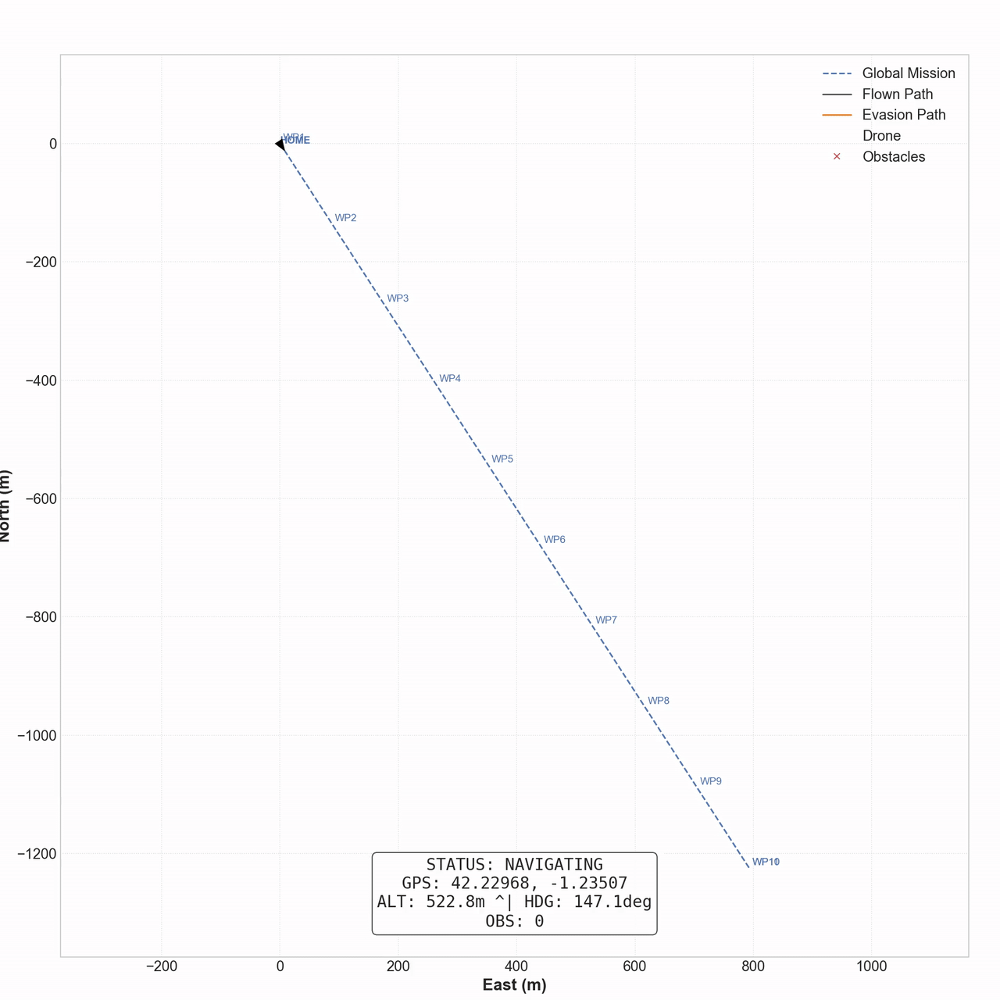

# Deep-AeroTwin (PORCE)

<div align="center">
  
</div>

This repo contains a **Windows + WSL2** setup for running an ArduPilot Copter mission in **SITL**, ingesting obstacles over **HTTP**, and (optionally) running **YOLO** vision to feed the planner (**PORCE**).

The repo does not rely on a fixed install path: it is safe to move/rename the folder as long as you run scripts from the repo root (or use the provided launchers).

## Source Of Truth (Zero-Trust)

Everything stated here is derived from the code in this repo and/or from runs that were executed locally.

* **Pipeline A E2E runner:** `pipeline/e2e_flight_matrix.py`
* **Pipeline A Unreal+Vision E2E runner:** `pipeline/e2e_unreal_vision.py` (requires Unreal PIE window)
* **Brain (Flask + MAVLink + PORCE):** `pipeline/flight_controller.py`
* **PORCE planner (A*):** `pipeline/porce_manager.py`
* **SITL launcher (WSL):** `pipeline/run_sitl.sh`
* **Vision (MSS + YOLO -> `/api/obstacles`):** `pipeline/vision_system.py`

## Current Status (Verified)

**Pipeline A (SIMULATION) is operational and validated end-to-end.**

Verified on **2026-02-14** (Windows + WSL2):
* Unit tests:
  * `python -m unittest pipeline.test_unreal_api pipeline.test_geo_projector`: PASS
* E2E matrix (token disabled):
  * `porce_off_no_detections`: PASS
  * `porce_on_no_detections`: PASS
  * `porce_off_with_detections`: PASS (`saw_evasion=false`)
  * `porce_on_with_detections`: PASS (`saw_evasion=true`)
* E2E Unreal + Vision (Unreal PIE running, window capture + YOLO):
  * `porce_on_with_detections`: PASS (`inject_posts_total>0`, `saw_evasion=true`)
* Token enforcement (`PORCE_OBSTACLE_TOKEN` set):
  * `porce_on_with_detections`: PASS (`inject_posts_unauthorized=0`, `saw_evasion=true`)

Full logs: `docs/test_runs/2026-02-14.md`

Verified again on **2026-02-15** (Windows 11 + WSL2 + Ubuntu + real SITL):
* `tools\fix_wsl_sitl_real.ps1` end-to-end: PASS
* E2E matrix (real WSL + SITL): 4/4 PASS

## Pipelines

### Pipeline A (SIMULATION)

* Starts **ArduPilot Copter SITL** in WSL (`pipeline/run_sitl.sh`).
* Starts the **Brain** on Windows (`pipeline/flight_controller.py`) and connects MAVLink to `tcp:127.0.0.1:5760`.
* Optional: starts **Vision** (`pipeline/vision_system.py`) which uses **MSS screen capture** + YOLO and POSTs obstacles to the Brain.
* Optional: starts **Viz recorder** (`pipeline/viz_recorder.py`) which polls `/api/ui/data` and writes PNG frames under `pipeline/logs/viz_frames/`.
* Optional: assemble a GIF from those frames: `python tools/make_gif_from_viz_frames.py --in-dir pipeline/logs/viz_frames --out pipeline/logs/viz.gif --fps 10 --width 960`

Vision capture modes (Pipeline A):
* Preferred (robust): capture Unreal PIE by window title (client area, 640x640):
  * Set `PORCE_CAPTURE_WINDOW_TITLE` to a substring of the PIE window title (example: `AirTraffic Preview`; see `docs/img/unreal_pie_window_title.png`). Use `python tools/list_windows.py` to enumerate windows.
  * Optional: `set PORCE_CAPTURE_WINDOW_FOCUS=1` (default) and `set PORCE_CAPTURE_WINDOW_TOPMOST=1`
  * Expected viewport size (warns if mismatch): `PORCE_CAPTURE_EXPECT_WIDTH=640`, `PORCE_CAPTURE_EXPECT_HEIGHT=640`
* Fallback: capture monitor/ROI via `PORCE_CAPTURE_MONITOR` or `PORCE_CAPTURE_LEFT/TOP/WIDTH/HEIGHT`.
* YOLO debug window (boxes + class/confidence + FPS):
  * Enabled by default in Pipeline A: `PORCE_VISION_DEBUG_WINDOW=1`
  * Dock next to Unreal window: `PORCE_VISION_DEBUG_DOCK=1` (default when using window capture)
  * Optional: `PORCE_VISION_TARGET_FPS=30` (0 = as fast as possible)

Launchers:
* `launch_pipeline_A.bat` (Windows Terminal tabs, recommended)
* `launch_pipeline_B.bat` (Windows Terminal tabs)
* E2E harness: `pipeline/e2e_flight_matrix.py` (recommended for CI-like validation)
* E2E harness (Unreal+Vision): `pipeline/e2e_unreal_vision.py`

Stop:
* `powershell -NoProfile -ExecutionPolicy Bypass -File tools/stop_pipeline.ps1` (stops Brain/Vision/Viz/Log + SITL)

### Pipeline B (REAL_TWIN) (Not Validated / Experimental)

The repo includes `launch_pipeline_B.bat` and the Brain exposes `/api/unreal/sync`, but **Pipeline B is not yet "real drone + real video"**:
* The Brain MAVLink connection is still hard-coded to `tcp:127.0.0.1:5760` (`pipeline/flight_controller.py`).
* Vision currently uses **MSS screen capture** (no RTSP/VideoCapture integration yet) (`pipeline/vision_system.py`).

Treat Pipeline B as a placeholder until those pieces are made configurable and validated.

## Quick Start (Pipeline A)

0. Preflight (optional but recommended):
   ```powershell
   powershell -NoProfile -ExecutionPolicy Bypass -File tools\preflight_pipeline_a.ps1
   ```
   If WSL/SITL is not set up yet (or WSL is broken), run the real fix script from an **elevated** PowerShell:
   ```powershell
   powershell -NoProfile -ExecutionPolicy Bypass -File tools\fix_wsl_sitl_real.ps1
   ```
1. Install Python deps:
   ```bash
   pip install -r pipeline/requirements.txt
   ```
2. Ensure WSL has an ArduCopter SITL binary:
   * Preferred: initialize/build the `ardupilot` submodule.
   * Fallback supported by code: a WSL home clone at `$HOME/ardupilot/build/sitl/bin/arducopter`.
   * Override supported by code: set `ARDUPILOT_SITL_BIN=/path/to/arducopter` (WSL env).
3. Run one E2E scenario:
   ```powershell
   python pipeline\e2e_flight_matrix.py --scenario porce_off_no_detections --scenario-timeout 420 --arm-timeout 240 --takeoff-timeout 180
   ```
   If WSL/SITL is unavailable (restricted environments), you can still run the Brain+PORCE E2E in mock mode:
   ```powershell
   python pipeline\e2e_flight_matrix.py --scenario porce_off_no_detections --mock-sitl --scenario-timeout 420 --arm-timeout 60 --takeoff-timeout 60
   ```
   Note: `--mock-sitl` does not validate real MAVLink/SITL integration.

## Real WSL2 + SITL Setup (Recovery Script)

If WSL works but SITL is missing, or if WSL is broken after a Windows update, use:

```powershell
# Run from repo root (D:\Deep-AeroTwin) in an elevated PowerShell:
powershell -NoProfile -ExecutionPolicy Bypass -NoExit -File tools\fix_wsl_sitl_real.ps1 -PauseOnExit
```

What it does (step-based, audited):
* Ensures Windows features are enabled: `Microsoft-Windows-Subsystem-Linux`, `VirtualMachinePlatform` (may require reboot).
* Restarts WSL-related services (best-effort) and validates `wsl --status` and `wsl -l -v`.
* Ensures a distro exists (auto-selects your default distro; typically `Ubuntu`).
* Clones + builds ArduPilot Copter SITL in WSL home: `~/ardupilot/build/sitl/bin/arducopter`.
* Runs `tools\preflight_pipeline_a.ps1`.

Logs:
* Transcript is saved under `pipeline\logs\fix_wsl_sitl_real_*.txt`
* Latest transcript pointer: `pipeline\logs\last_fix_wsl_sitl_real.txt`

## Full E2E Matrix (Real)

Run the full matrix (copy/paste as a single line):

```powershell
@('porce_off_no_detections','porce_on_no_detections','porce_off_with_detections','porce_on_with_detections') | % { python pipeline\e2e_flight_matrix.py --scenario $_ --scenario-timeout 420; if ($LASTEXITCODE -ne 0) { break } }
```

## Troubleshooting (Common CLI Mistakes)

* `argument --arm-timeout: expected one argument`:
  * You ran `--arm-timeout` without its number (example: `--arm-timeout 240`).
* `TIMEOUT /?` appears:
  * Your command got split across lines and Windows executed the `timeout` program. Copy/paste the command as a single line.

## Pipeline A E2E Matrix

| Scenario | PORCE_ENABLE_EVASION | Obstacle injection | Expected `saw_evasion` |
| :--- | :---: | :---: | :---: |
| `porce_off_no_detections` | 0 | no | false |
| `porce_on_no_detections` | 1 | no | false |
| `porce_off_with_detections` | 0 | yes | false |
| `porce_on_with_detections` | 1 | yes | true |

Logs per run:
* `pipeline/logs/e2e/<scenario>_<timestamp>/brain.log`
* `pipeline/logs/e2e/<scenario>_<timestamp>/sitl.log`

## Obstacle Ingestion Token (Zero-Trust)

If `PORCE_OBSTACLE_TOKEN` is set, the Brain requires all `POST /api/obstacles` to include:
* Header: `X-PORCE-Token: <PORCE_OBSTACLE_TOKEN>`

When the token is enabled, the E2E harness asserts `inject_posts_unauthorized=0`.

Distance handling (zero-trust):
* When an obstacle includes `lat/lon`, the Brain computes distance from the drone position (haversine) and does not rely on the reported `distance` field for PORCE triggering.

## Vision Model (YOLO)

* Default weights (committed): `pipeline/weights/yolo_3d_dome_v1_best.pt`
* Override: set `PORCE_YOLO_MODEL` to a different `.pt` path.
* Classes in the committed model: `biker`, `cow`, `tower`.

Vision posts obstacles as:
* `type`, `confidence`, `source`, `bbox` + `lat/lon/distance` (see `pipeline/vision_system.py`).

### Vision Geo Projection (Pixel -> Ground)

Vision projects a detection to a ground point using:
* Pinhole camera model (VFOV + frame aspect ratio)
* Vehicle attitude (`yaw`, `pitch`, `roll`) and AGL (`rel_alt`)
* A fixed camera mount rotation (default: `-30` deg pitch, i.e. 30 deg down from horizon)

Key env vars:
* `PORCE_CAMERA_VFOV_DEG` (defaults to `CAMERA_FOV_VERTICAL` in `pipeline/constants.py`)
* `PORCE_CAMERA_MOUNT_PITCH_DEG` (defaults to `-30`)
* `PORCE_CAMERA_MOUNT_ROLL_DEG`, `PORCE_CAMERA_MOUNT_YAW_DEG` (defaults to `0`)
* `PORCE_CAPTURE_MONITOR` (defaults to `1`)
* Optional ROI (recommended if Unreal is not fullscreen, for correct geometry):
  * `PORCE_CAPTURE_LEFT`, `PORCE_CAPTURE_TOP`, `PORCE_CAPTURE_WIDTH`, `PORCE_CAPTURE_HEIGHT`

Evaluation:
* Projection error / sensitivity tool: `tools/eval_projection_error.py`
* Run logs and example outputs: `docs/PROJECTION_ERROR_EVAL.md`

## Synthetic Training (OBJ -> Dome Dataset -> YOLO)

Assets:
* `3d_to_dataset_xabi/assets/biker.obj`
* `3d_to_dataset_xabi/assets/cow.obj`
* `3d_to_dataset_xabi/assets/tower.obj`

Generate + train:
```powershell
cd 3d_to_dataset_xabi
python generate_dataset.py --num-per-class 2000 --imgsz 640 --preview
python train_yolo.py --epochs 50 --imgsz 640 --batch 32 --device 0 --name yolo_3d_dome_v1
```

Notes:
* `3d_to_dataset_xabi/dataset/` and `3d_to_dataset_xabi/runs/` are **not committed** (ignored by git).
* The generator samples camera viewpoints from the **upper hemisphere** ("dome", drone-like: always above the object) and applies heavy domain randomization.

## Repo Layout

* `pipeline/`: runtime (Brain, Vision, E2E runner, launch helpers).
* `pipeline/weights/`: committed final YOLO weight used by Vision by default.
* `3d_to_dataset_xabi/`: synthetic dataset generation + training scripts.
* `tools/`: small developer utilities (e.g. `tools/inspect_model.py`, `tools/check_status.py`).
* `Unreal/`: Unreal project sources (generated binaries/cache are ignored).

## Known Gaps / TODO (Code-Based)

* Make MAVLink connection configurable for a real drone (Brain currently hardcodes SITL TCP).
* Implement/validate video ingestion for REAL_TWIN (Vision currently uses MSS capture).
* Add a deterministic Unreal scene/route for CI-like Vision-in-the-loop validation (window capture E2E depends on what the camera sees).

## License
Proprietary. All rights reserved.
